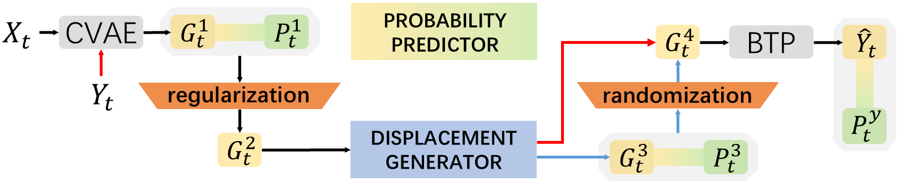

#  R-RNet: Probability-Driven Networks for Pedestrian Trajectory Prediction

This repo contains the code for our paper: [R-RNet: Probability-Driven Networks for
 Pedestrian Trajectory Prediction].

Our R-RNet architecture:



## Installation
### Dependencies

* Python == 3.7
```
pip install -r requirements.txt
```

## Training
To train on ETH-UCY dataset, the users can download the trajectory files ('.pkl') from the [Trajectron++](https://github.com/StanfordASL/Trajectron-plus-plus) repo and put them at the `DATASET.TRAJECTORY_PATH` in the configuration file.

Users can train the R-RNet models on ETH-UCY dataset easily by runing the following command:
```
python tools/train.py
```

## Inference 
Test the model on ETH-UCY datasets.
```
python tools/test.py
```