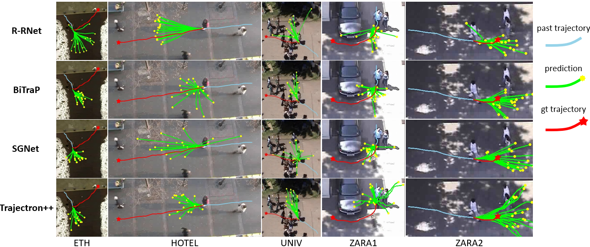
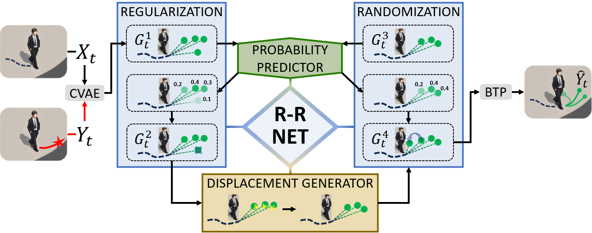

#  R-RNet: Probability-Driven Networks for Pedestrian Trajectory Prediction

This repo contains the code for our paper: [R-RNet: Probability-Driven Networks for
 Pedestrian Trajectory Prediction].

## 🌈 Visualization Comparison

**R-RNet** can flexibly adapt to the random walking behavior of pedestrians.



## 🧩 Model Architecture



**Workflow**:
1. **Goal Sampling**: Goals are sampled from the latent space constructed by a CVAE, capturing diverse possible intentions
2. **Probability Prediction**: Sampled goals are concatenated with observation sequences to predict the corresponding probabilities
3. **Goal Refinement**: The predicted goals are fed into the R-R module and displacement generator to produce refined goals
4. **Trajectory Prediction**: The updated goals are input into BTP to forecast complete trajectories

## ⚙️ Environment Setup

* Python == 3.7
```
pip install -r requirements.txt
```

## 🚀 Quick Start
### Training
To train on ETH-UCY dataset, the users can download the trajectory files ('.pkl') from the [Trajectron++](https://github.com/StanfordASL/Trajectron-plus-plus) repo and put them at the `DATASET.TRAJECTORY_PATH` in the configuration file.

Users can train the R-RNet models on ETH-UCY dataset easily by runing the following command:
```
python tools/train.py
```

### Inference 
Test the model on ETH-UCY datasets.
```
python tools/test.py
```
